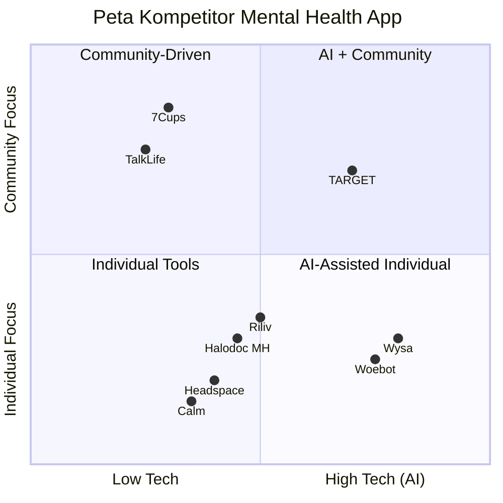
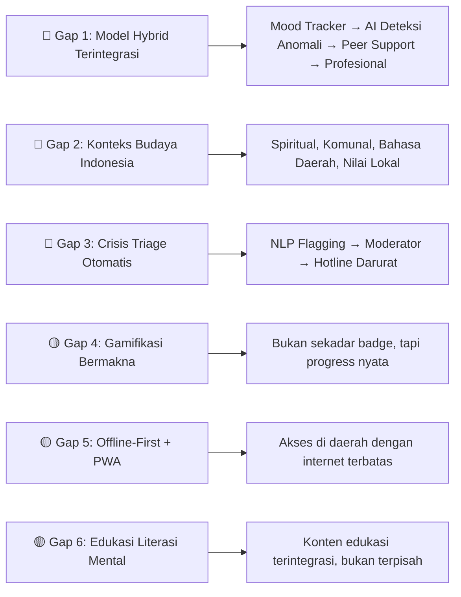

# 🧠 Deep Research: Platform Kesehatan Mental Digital
## Laporan Riset Komprehensif — Agustus 2026

---

## Daftar Isi
1. [Urgensi & Latar Belakang](#1-urgensi--latar-belakang)
2. [Jurnal & Riset Internasional](#2-jurnal--riset-internasional)
3. [Jurnal & Kondisi Indonesia](#3-jurnal--kondisi-kesehatan-mental-di-indonesia)
4. [Stigma Kesehatan Mental di Indonesia](#4-stigma-kesehatan-mental-di-indonesia)
5. [AI & NLP untuk Deteksi Krisis](#5-ai--nlp-untuk-deteksi-krisis)
6. [Prinsip Desain UX/UI](#6-prinsip-desain-uxui-untuk-aplikasi-kesehatan-mental)
7. [Panduan WHO](#7-panduan-who-untuk-kesehatan-mental-digital)
8. [Proyek Open Source (GitHub)](#8-proyek-open-source-github)
9. [Analisis Kompetitor](#9-analisis-kompetitor--produk-yang-sudah-ada)
10. [Gap Analysis & Peluang](#10-gap-analysis--peluang)
11. [Rekomendasi Fitur Berbasis Bukti](#11-rekomendasi-fitur-berbasis-bukti)
12. [Daftar Referensi](#12-daftar-referensi)

---

## 1. Urgensi & Latar Belakang

> [!IMPORTANT]
> Kesehatan mental adalah salah satu krisis global terbesar abad ini. WHO memperkirakan **1 dari 8 orang** di dunia hidup dengan gangguan mental, dan pandemi COVID-19 telah memperburuk situasi ini secara signifikan.

### Mengapa Platform Digital?
- **Treatment Gap**: Lebih dari **75%** orang dengan gangguan mental di negara berpenghasilan rendah-menengah TIDAK mendapatkan perawatan
- **Stigma**: Penghalang #1 dalam mencari bantuan — terutama di budaya kolektif seperti Indonesia
- **Aksesibilitas**: Platform digital dapat menjangkau siapapun, kapanpun, di manapun
- **Anonimitas**: Menghilangkan rasa malu dan takut dihakimi

---

## 2. Jurnal & Riset Internasional

### 2.1 Efektivitas Digital Mental Health Interventions (DMHI)

| Temuan | Detail | Sumber |
|:-------|:-------|:-------|
| **iCBT Efektif** | Internet-based Cognitive Behavioral Therapy secara signifikan mengurangi gejala depresi & kecemasan | JMIR Publications; Cambridge University Press |
| **Engagement = Kunci** | Adherence/kepatuhan pengguna adalah prediktor utama keberhasilan. Gamifikasi & personalisasi meningkatkan engagement | NIH Systematic Reviews (2024) |
| **Hybrid > Mandiri** | Intervensi digital + panduan manusia jauh lebih efektif dari fully self-guided | Journal EHDI (2024) |
| **Remaja & Mahasiswa** | DMHI efektif untuk populasi muda; gamifikasi & keterlibatan orangtua meningkatkan hasil | NIH, Emerald (2024-2025) |
| **Zona Konflik** | Intervensi mobile & AI-driven menunjukkan hasil kuat untuk PTSD, depresi, kecemasan | STIKES Kesdam Review |

### 2.2 Tantangan yang Belum Terpecahkan
- **Long-term Efficacy**: Data follow-up jangka panjang masih kurang
- **Dropout Rates**: Mempertahankan pengguna tetap aktif adalah tantangan universal
- **Heterogenitas Studi**: Variasi desain studi menyulitkan perbandingan langsung

### 2.3 Peer Support Anonim
- Platform peer support anonim **terbukti mengurangi isolasi sosial**
- Efektivitas **sangat bergantung pada moderasi terstruktur**
- Tanpa moderasi yang baik → risiko penyebaran perilaku maladaptif
- Model **"guided peer support"** lebih aman dan efektif dari unmoderated

### 2.4 AI Chatbot (Wysa, Woebot)
- Chatbot berbasis CBT **terbukti klinis** mengurangi gejala kecemasan melalui micro-interventions
- Tantangan: akurasi deteksi krisis, transparansi AI, "uncanny valley" effect

---

## 3. Jurnal & Kondisi Kesehatan Mental di Indonesia

### 3.1 Statistik Kunci

> [!CAUTION]
> Data ini menunjukkan skala masalah yang sangat besar di Indonesia.

| Indikator | Data | Sumber |
|:----------|:-----|:-------|
| **Prevalensi Gangguan Jiwa** | 9.8%–10.35% populasi (~28 juta orang) | Kemenkes RI |
| **Anak dengan Masalah Kejiwaan** | ~10% anak Indonesia (4.4% anxiety, 4.8% depresi) | Program CKG 2025–2026 |
| **Remaja dengan Gangguan Mental** | 5.5% usia 10–17 tahun | Survei Nasional |
| **Percobaan Bunuh Diri Remaja** | Naik dari 3.9% (2015) → 10.7% (2023) | Data Kemenkes |
| **Kerugian Ekonomi** | Rp463.8 triliun (2.1% PDB) dari kecemasan & depresi | Studi Ekonomi 2025 |
| **Diagnosis Gap** | >60% individu dengan gejala belum pernah didiagnosis formal | Riset SKI 2023 |
| **Waktu Online** | >7 jam/hari rata-rata | Data Internet Indonesia |
| **Pencarian Info Kesehatan Mental Online** | 97% pengguna internet | Survei Digital |
| **Psikolog/Psikiater merekomendasikan telekonseling** | 87.8% | Jurnal BK Islam |

### 3.2 Temuan Penelitian Nasional 2024–2025
- **Disparitas Geografis**: Jawa Barat, Jawa Tengah, Jawa Timur memiliki prevalensi depresi tertinggi (faktor urbanisasi & sosio-ekonomi)
- **Mahasiswa**: Prevalensi masalah mental emosional tinggi — faktor: tekanan akademik, kepribadian, keharmonisan hidup
- **Retensi Pengguna**: Tantangan terbesar BUKAN adopsi awal, tapi mempertahankan pengguna jangka panjang
- **Pemerintah**: Kemenkes memperkuat layanan jiwa di Puskesmas, menambah psikolog klinis, sosialisasi P3LP

### 3.3 Referensi Jurnal Nasional
- *Kesehatan Mental Mahasiswa di Era Digital* — Jurnal Psikologi Insight
- *Praktik Telekonseling Berbasis Teknologi Digital* — Jurnal Bimbingan Konseling Islam
- *Indonesian Journal of Global Health Research* — berbagai studi stigma & intervensi
- *Buletin Riset Psikologi dan Kesehatan Mental (BRPKM)*
- Data Kementerian Kesehatan RI (2025)

---

## 4. Stigma Kesehatan Mental di Indonesia

> [!WARNING]
> Stigma masih menjadi PENGHALANG UTAMA akses layanan kesehatan mental di Indonesia.

### 4.1 Bentuk Stigma yang Masih Ada
- **Pelabelan negatif**: Istilah "gila", "sakit jiwa" masih umum
- **Stereotip berbahaya**: Gangguan mental = berbahaya/tak bisa disembuhkan
- **Diskriminasi sosial**: Pengucilan dari komunitas
- **Pasung**: Masih terjadi di beberapa daerah
- **Stigma keluarga**: Malu, nama baik keluarga terancam

### 4.2 Faktor Budaya
- **Budaya kolektif**: Nama baik keluarga > kebutuhan individu
- **Kepercayaan supranatural**: Gangguan jiwa dikaitkan dengan faktor mistis
- **Literasi rendah**: Kurangnya pemahaman tentang kesehatan mental
- **Kurangnya iman**: Persepsi bahwa gangguan mental = lemah secara spiritual

### 4.3 Implikasi untuk Desain Platform
- ✅ **Anonimitas penuh** wajib di fitur komunitas
- ✅ **Bahasa yang menormalisasi**: Hindari istilah klinis yang menakutkan
- ✅ **Framing positif**: "Self-care" & "kesejahteraan" vs "gangguan mental"
- ✅ **Pendekatan budaya**: Integrasi spiritual, nilai-nilai lokal
- ✅ **Edukasi gradual**: Tingkatkan literasi kesehatan mental perlahan

### 4.4 Referensi Stigma
- Maulana & Platini (2025) — *Indonesian Journal of Global Health Research*
- Jamal & Arifian (2025) — *Asian Journal of Psychiatry*
- Rahmani et al. (2024) — Studi literasi kesehatan mental & stigma
- Hendriyani (2025) — Studi kualitatif peran keluarga, Bandung

---

## 5. AI & NLP untuk Deteksi Krisis

### 5.1 Perkembangan Terkini (2024–2026)

| Aspek | Status |
|:------|:-------|
| **Metode** | Bergeser dari keyword detection → Deep Learning (BERT, LSTM, CNN-LSTM) → LLM (GPT-4o, fine-tuned models) |
| **Kontekstual** | Mampu mendeteksi sarkasme, metafora, referensi tidak langsung |
| **Real-time** | Human-in-the-loop: AI flag → moderator manusia intervensi |
| **Prediktif** | "Suicidal trajectories" — melacak perubahan linguistik longitudinal |

### 5.2 Tantangan Etis
- **Bias algoritmik**: Risiko diskriminasi terhadap demografi tertentu
- **Safety gap chatbot**: Chatbot umum TIDAK memiliki "psychiatric guardrails" yang memadai
- **Privasi**: Data sangat sensitif, membutuhkan proteksi maksimal
- **Over-reliance**: AI = alat bantu, BUKAN pengganti profesional

### 5.3 Rekomendasi Implementasi
1. **Human-in-the-loop WAJIB**: AI flag risiko tinggi → moderator manusia review & intervensi
2. **Transparansi**: Pengguna harus tahu kapan AI terlibat
3. **Gradual rollout**: Mulai dari deteksi keyword sederhana, tingkatkan ke NLP seiring waktu
4. **Fail-safe**: Selalu sediakan akses langsung ke hotline krisis

---

## 6. Prinsip Desain UX/UI untuk Aplikasi Kesehatan Mental

### 6.1 Prinsip Visual

| Prinsip | Detail |
|:--------|:-------|
| **Low-Stimulus** | Interface tenang, minimalis, mengurangi beban kognitif |
| **Warna** | Palet soft/pastel: biru, hijau, lavender. Hindari warna agresif |
| **Navigasi** | Prediktif, konsisten, tidak membingungkan |
| **Progressive Disclosure** | Tampilkan konten secara bertahap, biarkan pengguna mengatur tempo |
| **Tipografi** | Font yang mudah dibaca, ukuran cukup besar, kontras memadai |

### 6.2 Prinsip Empati
- Copywriting non-judgmental dan hangat
- Validasi perasaan pengguna, bukan "solusi instan"
- Onboarding yang gentle & tidak memaksa
- Kemampuan "quick exit" untuk privasi

### 6.3 Fitur Keselamatan (Safety) — NON-NEGOTIABLE

> [!CAUTION]
> Fitur keselamatan HARUS ada dan mudah diakses di SEMUA layar utama.

- 🆘 **Tombol SOS 1-tap** — akses langsung ke hotline darurat
- 📋 **Safety Plan Digital** — rencana keselamatan personal (warning signs, coping strategies, kontak darurat)
- 🛡️ **Moderasi Komunitas Ketat** — untuk mencegah harm
- 🔒 **Privasi by Default** — anonimitas di forum, enkripsi data
- 📊 **Granular Privacy Controls** — pengguna kontrol penuh atas data

### 6.4 Aksesibilitas
- Standar WCAG 2.2 sebagai baseline
- Usable oleh pengguna dengan variasi kemampuan kognitif & fisik
- Tidak menambah barrier bagi yang sudah dalam kondisi distress

---

## 7. Panduan WHO untuk Kesehatan Mental Digital

### 7.1 Prinsip Utama WHO
1. **Komplementer, bukan pengganti**: Alat digital = pelengkap sistem kesehatan konvensional
2. **Guided > Self-guided**: Intervensi terpandu jauh lebih efektif
3. **Equity & Access**: Digital tools harus menjembatani treatment gap, bukan memperlebarnya
4. **Responsible AI**: Privasi, keamanan, dan hak asasi manusia "by design"

### 7.2 Dokumen Kunci WHO (2024–2026)
- **Global Strategy on Digital Health (2020–2027)** — framework overarching
- **Digital Determinants of Youth Mental Health (Mei 2025)** — 8 prioritas aksi untuk melindungi kesehatan mental remaja di lingkungan digital
- **SMART Guidelines** — standar interoperabilitas sistem kesehatan digital
- **Rekomendasi Kondisional** — untuk intervensi digital mandiri (CBT, DBT, PST, mindfulness) bagi individu dengan pikiran bunuh diri

### 7.3 Implikasi untuk Platform
- ✅ Integrasikan jalur eskalasi ke profesional
- ✅ Jangan klaim sebagai pengganti terapi
- ✅ Transparan tentang batasan teknologi
- ✅ Ikuti SMART Guidelines untuk interoperabilitas data

---

## 8. Proyek Open Source (GitHub)

### 8.1 Mood Tracker & Journaling

| Proyek | Teknologi | Fitur Utama | Link |
|:-------|:----------|:------------|:-----|
| **MoodTracker** | PWA, Serverless | Offline-first, privasi, mood tracking | [GitHub](https://github.com/benji6/moodtracker) |
| **Tempo** | PWA | Diary, mood tracker, Kanban, data lokal | [GitHub](https://github.com/agateblue/tempo) |
| **Baseline** | React, TypeScript, Ionic | Journaling, mood tracking, mobile & web | [GitHub](https://github.com/nkalupahana/baseline) |
| **MoodSnap** | iOS/Swift | Mood diary, analytics, untuk mood disorders | [GitHub](https://github.com/drpeterrohde/MoodSnap) |
| **Mini Moods** | Android | Mood tracker, ad-free, privasi | [GitHub](https://github.com/CampbellMG/MiniMoods) |

### 8.2 Peer Support & Komunitas

| Proyek | Teknologi | Fitur Utama | Link |
|:-------|:----------|:------------|:-----|
| **if-me** | Ruby on Rails | Komunitas, berbagi progres dengan allies | [GitHub](https://github.com/ifmeorg/ifme) |
| **MoodAlbum** | — | Sharing feelings, daily check-ins | [GitHub](https://github.com/Xcccy01/MoodAlbum) |
| **MyMind** | Web | Mental health app + built-in chat | [GitHub](https://github.com/salesp07/MyMind) |

### 8.3 AI & Wellness

| Proyek | Teknologi | Fitur Utama | Link |
|:-------|:----------|:------------|:-----|
| **MindWell** | Web | Mood tracking + self-assessment + mindfulness | [GitHub](https://github.com/rudra496/mindwell) |
| **OpenGnothia** | Desktop | AI-assisted therapy, journaling, privasi | [GitHub Topics](https://github.com/topics/mental-health) |

### 8.4 Pelajaran dari Open Source
- 🟢 **Privasi-first** adalah pendekatan dominan
- 🟢 **Offline-first/PWA** populer untuk aksesibilitas
- 🟡 **Peer support** masih jarang di open-source
- 🔴 **Crisis detection** hampir tidak ada di proyek open-source
- 🔴 **Cultural adaptation** (khususnya untuk Indonesia) belum ada sama sekali

---

## 9. Analisis Kompetitor & Produk yang Sudah Ada

### 9.1 Peta Kompetitor

### 9.2 Detail Analisis

| Platform | Kelebihan | Kekurangan |
|:---------|:----------|:-----------|
| **Headspace & Calm** | Konten audio premium, UI indah | Bukan untuk intervensi klinis/krisis, mahal |
| **7Cups** | Peer-support terbesar, "listeners" anonim, instan | Kualitas listener bervariasi, berbahaya untuk krisis akut |
| **Wysa & Woebot** | AI chatbot CBT, mudah diakses, non-judgmental | Batas kontekstual AI, pengguna sadar bicara dengan mesin |
| **Riliv** | Tenaga ahli lokal berlisensi, paham budaya Indonesia | Fokus di telekonseling berbayar, kurang fitur preventif |
| **Halodoc (Mental Health)** | Akses ke profesional, terintegrasi ekosistem kesehatan | Kurang fitur komunitas/peer-support gratis |

### 9.3 Celah Pasar yang Belum Terisi
1. **Tidak ada platform yang menggabungkan** mood tracking + peer support + AI screening + eskalasi profesional dalam satu tempat
2. **Kurangnya adaptasi budaya Indonesia** — kebanyakan "translate" konsep Barat
3. **Fitur preventif gratis** hampir tidak ada di platform lokal
4. **Crisis triage otomatis** di forum komunitas belum ada

---

## 10. Gap Analysis & Peluang

> [!TIP]
> Ini adalah peluang terbesar yang bisa diisi oleh platform baru.

### 10.1 Gap Utama

### 10.2 Peluang Unik untuk Platform Ini

| Peluang | Justifikasi |
|:--------|:------------|
| **Model Hybrid "Escalation Ladder"** | Jika mood tracking mendeteksi anomali negatif berturut-turut → otomatis tawarkan transisi halus ke peer support → jika eskalasi → koneksi ke profesional |
| **Cultural Tailoring Indonesia** | Dukungan spiritual, pendekatan komunal, bahasa yang tidak menakutkan, konten dalam Bahasa Indonesia yang BUKAN sekadar terjemahan |
| **Crisis NLP Triage** | AI mendeteksi postingan berisiko di forum → flag ke moderator → eskalasi ke hotline darurat. Ini BELUM ADA di platform manapun secara terintegrasi |
| **Gratis + Berkelanjutan** | Model freemium: fitur inti gratis, konsultasi profesional berbayar |
| **PWA Offline-First** | Bisa diinstall di HP tanpa app store, bekerja offline untuk journaling & mood tracking |

---

## 11. Rekomendasi Fitur Berbasis Bukti

### 11.1 Fitur Inti (MVP — Prioritas 1)

| # | Fitur | Justifikasi Ilmiah |
|:--|:------|:-------------------|
| 1 | **Mood Tracker Harian** | Terbukti meningkatkan self-awareness & early detection (MoodTracker, Baseline studies) |
| 2 | **Journaling Terstruktur** | CBT-based journaling efektif mengurangi gejala depresi & kecemasan (JMIR, NIH) |
| 3 | **Forum Anonim + Peer Support** | Mengurangi isolasi sosial, mengatasi stigma (7Cups research, WHO) |
| 4 | **Tombol SOS + Hotline** | Safety feature wajib ada di semua layar (WHO guidelines, UX best practices) |
| 5 | **Safety Plan Digital** | Bukti kuat untuk pencegahan bunuh diri (VA, MDPI research) |
| 6 | **Bilingual (ID + EN)** | 97% pengguna internet Indonesia mencari info kesehatan mental online |

### 11.2 Fitur Lanjutan (Prioritas 2)

| # | Fitur | Justifikasi |
|:--|:------|:------------|
| 7 | **AI Mood Analysis** | Deteksi pola negatif berturut-turut → trigger rekomendasi bantuan |
| 8 | **Guided Mindfulness** | Headspace/Calm model — terbukti efektif untuk stress (systematic reviews) |
| 9 | **Gamifikasi** | Meningkatkan engagement jangka panjang — tantangan terbesar (NIH, MDPI) |
| 10 | **Konten Edukasi Literasi** | Literasi ↑ = Stigma ↓ = Pencarian bantuan ↑ (Rahmani et al. 2024) |
| 11 | **Direktori Profesional** | Link ke psikolog/psikiater terdekat |

### 11.3 Fitur Advanced (Prioritas 3)

| # | Fitur | Justifikasi |
|:--|:------|:------------|
| 12 | **NLP Crisis Detection** | Human-in-the-loop flagging di forum (CLPsych, BERT research) |
| 13 | **AI Chatbot Companion** | Micro-interventions CBT seperti Wysa/Woebot |
| 14 | **Escalation Ladder** | Mood tracker → peer support → profesional (Gap analysis) |
| 15 | **Cultural Adaptation** | Konten spiritual, komunal, bahasa daerah (Jamal & Arifian 2025) |

---

## 12. Daftar Referensi

### Jurnal Internasional
1. JMIR Publications — Systematic reviews on DMHI effectiveness
2. Cambridge University Press — Global Mental Health journal
3. NIH/PMC — Multiple systematic reviews (2024–2025) on digital interventions
4. Emerald — Digital interventions in higher education
5. MDPI — Children, adolescents & gamification in mental health
6. CLPsych Shared Tasks — NLP for suicide risk detection

### Jurnal Nasional
7. Jurnal Psikologi Insight — Kesehatan Mental Mahasiswa di Era Digital
8. Jurnal Bimbingan Konseling Islam — Praktik Telekonseling Digital
9. Indonesian Journal of Global Health Research — Stigma & intervensi
10. Buletin Riset Psikologi dan Kesehatan Mental (BRPKM)
11. Asian Journal of Psychiatry — Psychotherapy in Southeast Asia (Jamal & Arifian, 2025)
12. Rahmani et al. (2024) — Literasi kesehatan mental & stigma
13. Hendriyani (2025) — Peran keluarga & budaya kolektif, Bandung

### Organisasi & Guidelines
14. WHO — Global Strategy on Digital Health (2020–2027)
15. WHO — Digital Determinants of Youth Mental Health (2025)
16. WHO — Mental Health Gap Action Programme (mhGAP)
17. WHO — SMART Guidelines
18. Kementerian Kesehatan RI — Data Kesehatan Mental (2025)
19. Program Cek Kesehatan Gratis (CKG) 2025–2026

### Open Source
20. MoodTracker — https://github.com/benji6/moodtracker
21. Tempo — https://github.com/agateblue/tempo
22. Baseline — https://github.com/nkalupahana/baseline
23. if-me — https://github.com/ifmeorg/ifme
24. MindWell — https://github.com/rudra496/mindwell
25. Mini Moods — https://github.com/CampbellMG/MiniMoods
26. MoodAlbum — https://github.com/Xcccy01/MoodAlbum
27. MyMind — https://github.com/salesp07/MyMind

---

> [!NOTE]
> **Laporan ini disusun pada Agustus 2026** berdasarkan riset dari jurnal internasional (JMIR, NIH, Cambridge, MDPI, Emerald), jurnal nasional Indonesia, data Kemenkes RI, panduan WHO, proyek open-source GitHub, dan analisis produk yang sudah ada di pasaran. Semua temuan di atas dapat dijadikan dasar ilmiah untuk pengembangan platform kesehatan mental digital.
